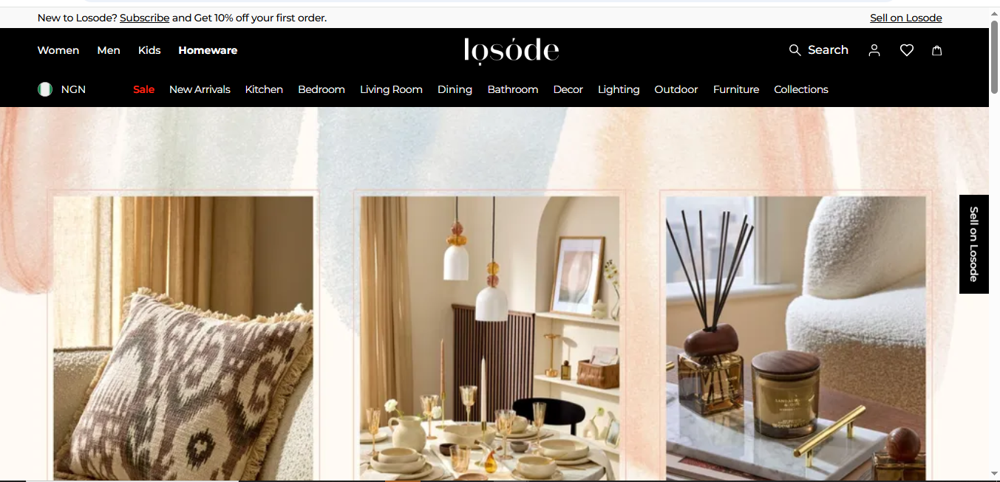
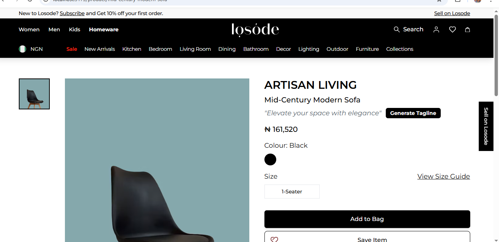
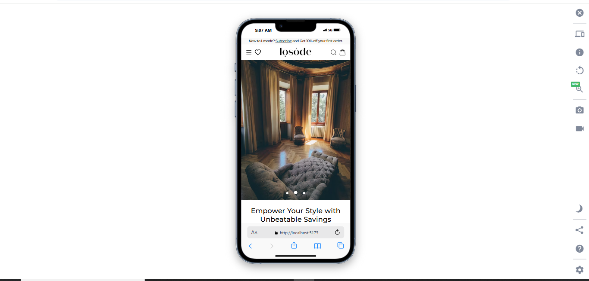

markdown

# Losode Home Category Page

## Overview

This project is a "Home" (Homeware) category page for Losode’s e-commerce platform, built as part of a Frontend Engineer assessment. The page matches the layout and style of Losode’s existing Men and Women category pages while showcasing homeware products (e.g., decor, textiles). It features a responsive React UI, clean and modular code, and an AI-powered **Product Tagline Generator** for enhanced user engagement.

## Technologies

- **React** (Vite for fast development)
- **Tailwind CSS** & **Material Tailwind** for styling
- **Lucide React** for icons
- **Montserrat** and **Playfair Display** fonts for Losode’s brand aesthetic
- Added **`react-slick`** to the list of technologies, since it’s used for the mobile hero slider.

## Features

- **Responsive Design**: Optimized for mobile (<640px), tablet (640px–1024px), and desktop (>1024px).
- **Modular Components**: Reusable components like `TopBanner`, `ProductCard`, `SearchModal`, and `SidebarButton` (z-60 for layering).
- **Losode Design**: Black-white theme, African-inspired CTAs, and a hero banner tailored for homeware.
- **Smooth UX**: Single scrollbar, intuitive navigation, and consistent styling.
- **AI-Powered Feature**: Product Tagline Generator (e.g., “Elevate your space with elegance”) integrated into product cards. Implemented with a mocked dataset of taglines for simplicity.

Usage
Visit the Home category page to explore the hero banner, product grid, and African-inspired CTAs.

On mobile, swipe through the hero slider to view different homeware banners; on desktop, view a single static banner.

Click the “Generate Tagline” button on any product details to display a dynamically generated tagline (e.g., “Transform your home with timeless charm”).

Test responsiveness by resizing the browser or using developer tools to simulate mobile/tablet views.

**Responsive Design Details**:

- In the `Features` section, added a sub-bullet under `Responsive Design` to explain the hero section:
  - Mobile: Uses a slider (`HeroSlider` component with `react-slick`) to display multiple images.
  - Desktop: Uses a single static banner (`TopBanner` component) for a focused presentation.


## Project Structure

├── public/ # Static assets
├── screenshots/
├── src/
│ ├── assets/ # Images
│ ├── components/ # Reusable components (e.g., ProductCard, TopBanner)
│ ├── pages/ # Home category page
│ ├── utils/ # Tagline generator logic
│ └── App.jsx # Main app component
├── README.md # Project documentation
└── package.json # Dependencies and scripts

## Setup

### Requirements

- Node.js (v16.0.0 or higher)
- npm (v8.0.0 or higher)

### Installation

1. Clone the repository:
   ```bash
   git clone https://github.com/Iamfineboyygabriel/losode-accesment.git
   ```

Navigate to the project directory:
bash

cd losode-assessment

Install dependencies:
bash

npm install

Start the development server:
bash

npm run dev

Open http://localhost:5173 in your browser to view the Home category page.

AI Feature: Product Tagline Generator
Description: An AI-powered feature that generates catchy taglines for homeware products to enhance user engagement.

Implementation: Mocked with a predefined list of taglines stored in src/utils/data.tsx. Taglines are randomly selected when the user clicks the “Generate Tagline” button.

Usage: Available on each Product details page. Click the button to display
a new tagline.

Assumptions and Notes
The tagline generator uses a mocked dataset for simplicity, as per the assessment’s focus on UI and modularity.

The design mirrors Losode’s Men and Women pages, with homeware-specific imagery and CTAs.

No external APIs were used to keep the setup lightweight.

Submission
Repository: https://github.com/Iamfineboyygabriel/losode-accesment.git

AI Feature: Product Tagline Generator (Option A)

Submitted By: [Akintola Babatunde Rafiu] for Losode Frontend Engineer Assessment, May 2025

Troubleshooting
Ensure Node.js and npm versions meet the requirements.

## Screenshots

Below are screenshots of the Home category page and its features:


_Desktop view of the Home category page with hero banner and product grid._


_Product Tagline Generator in action, displaying a generated tagline on a product card._

  
_Mobile view showcasing the responsive design with a sliding hero banner._

If npm install fails, delete node_modules/ and package-lock.json, then retry.

Contact [tundegabriel999@gmail.com (mailto: tundegabriel999@gmail.com)] for support.
